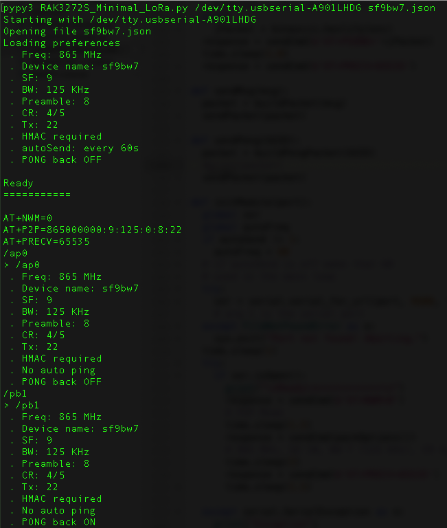
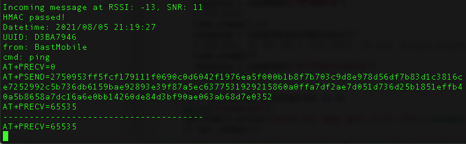
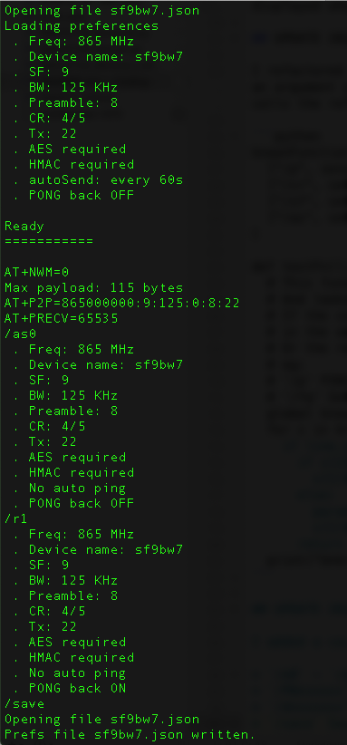
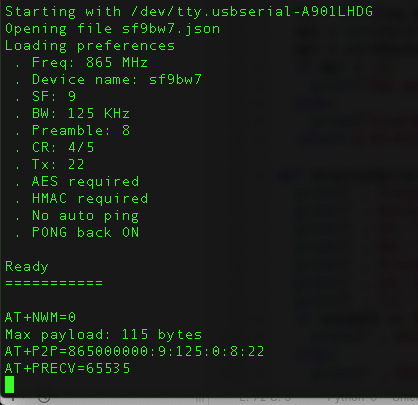

# RAK3272S

This is a collection of Python scripts (2 done, still evolving, more to come) and other info about the [RAK3272S](https://store.rakwireless.com/products/wisduo-breakout-board-rak3272s) Breakout Board. For now it comes with an [AT Firmware](https://docs.rakwireless.com/Product-Categories/WisDuo/RAK3272S-Breakout-Board/AT-Command-Manual/#introduction). Since the STM32WL is a new chip, it is quite a bit complicated to set up an environment to write C++ code for it (I've has a look at STM32CubeIDE, and I'm still dizzy from the deep dive...), so for now I am focusing on writing code that make using the AT firmware a little less painful and more user-friendly.

The STM32WL has been added to the STM32 Arduino BSP, sans the LoRa part. Once LoRa is available, I'll port my [Minimal LoRa](https://github.com/Kongduino/BastWAN_Minimal_LoRa) firmware to this chip, and we'll be able to use something a little less kludgy. In between, I'm going to work on tools that mimic the behavior of Minimal LoRa.

## Sender / Receiver

There are 2 scripts that do one thing each only: receiving or sending. The way the AT firmware is set up for P2P, it is a little complicated to have both. Basically, the firmware puts the chip in Tx mode, and if you want to receive, you have to let the firmware know, giving it a timeout value (stupid idea if you ask me). It's a 16-bit value, so the max value, 65535, means wait forever. Anything else, it waits that amount of milliseconds. Pfffrt. But what's worse, even if you're in the "wait forever" mode, once you receive a line, you're back to Tx mode. **THAT** is unusual cruelty.

So I had two breakout boards, and each was connected to a computer running one script. At startup, the script puts the firmware in P2P mode, sets up parameters (Frequency, SF, BW, etc) and sets Tx or Rx mode. The receiver will reset to receive mode every time a message is received.

Since these 2 operate on the same network of BastWAN devices I have, I need to emulate the protocol:

1. Messages are JSON packets. Not the most efficient, size-wise, but very easy to parse.
2. Messages are encrypted with AES256. So Sender needs to pad the packet and encrypt it. Receiver decrypts it.
3. But messages also have HMAC added to them. The last 28 bytes is the signature. Sender calculates SHA224 and tacks it on. Receiver compares the last 28 bytes with an HMAC it calculates on the rest of the packet.
4. Packets all have `UUID`, `from` and `cmd` keys. After which, there may or may not be other keys. Sender adds nothing else, but some of my BastWAN devices do. Receiver knows what to display. It also timestamps the packets so that you can keep a log of packets.

All in all, they already do quite a bit. I am looking into merging them, and adding more Minimal_Lora options. A more robust solution could involve making a GUI app in Xojo. We'll see...


## UPDATE 2021/08/05

I added a new script, `RAK3272S_Minimal_LoRa.py`, which mimics the `BastWAN_Minimal_LoRa` firmware to an extent, and I have been having more issues with SF/BW combinations related to payloads. At SF 10, BW 7 (125 KHz), packets sent from BastWAN devices are received by the whole network, both BastWAN and RAK3272S. On the other hand, packets sent by RAK3272S are not received, AT ALL, by BastWAN devices, and garbled on other RAK3272S. Checking on my SDR, something is indeed being sent, but the BastWAN devices don't even react to it. I think either the AT firmware, or the hardware itself, is much stricter than needed when it comes to payload limitations: after all, if the RAK3272S can receive long (~180 bytes) payloads, it should be able to send them too (and they were slightly shorter, about 160 bytes).

So while I confer with the product team, I have changed the SF/BW combo to SF 10, BW 9 (500 KHz) and long packets work fine now. SF 9, BW 7 also seems to work. I am adding various JSON prefs files for testing. You can pick a prefs file at launch by doing:

`python3 RAK3272S_Minimal_LoRa.py /dev/tty.usbserial-A901LHDG sf9bw7.json`

### Commands

I have added a few commands from Minimal_LoRa:

* `/p` Sends a `PING` packet
* `/>xxxx` Sends xxxx as a message
* `/hm0` ~ `/hm1` Turns `HMAC` OFF or ON
* `/r0` ~ `/r1` Turns `PONG back` OFF or ON (R = reply)
*  `/as0` ~ `asNUMBER` Turns `auto PING` OFF (0) or every x seconds
*  `/crNUMBER` Sets CR to 4/NUMBER (5~8)
*  `/fqNUMBER` Sets Frequency to NUMBER (860.0 ~ 1,020.0 MHz)

This is still a bit fragile, but seems to be working well enough! Have fun!




Added a `calcMaxPayload()` function that calculates the maximum payload you can send based on the SF/BW configuration. Returns -1 if (supposedly anyway) invalid. Data sourced from [TTN](https://www.thethingsnetwork.org/airtime-calculator). This calculation is displayed when calling `packOptions()`, ie when resetting options for the chip.

## UPDATE 2021/08/06

I refactored the part of the code that parses user input and evaluates commands. The commands, the relevant Fn, and whether they need an argument or not, is stored in an array, `knownFunctions`. A function, `testFn(line)`, parses the array, and if it finds a match, calls the relevant function. This makes it much easier to add commands.

```python
knownFunctions = [
  ["/p", sendPing, 0], ["/>", sendMsg, 1], ["/hm", setHmac, 1],
  ["/cr", setCr, 1], ["/tx", setTx, 1], ["/bw", setBw, 1],
  ["/sf", setSf, 1], ["/r", setRP, 1], ["/fq", setFq, 1],
  ["/as", setAs, 1]
]

def testFn(line):
  # This function takes one line from user input
  # And looks for a know command (see above)
  # If the command requires no arguments, 3rd value
  # in the array is 0, and the Fn is called as is.
  # Or the remainder of the line is passed as argument.
  # eg:
  # '/p' PING, no argument need. ["/p", sendPing, 0]
  # '/fq' Set Frequency, frequency needs to be passed: ["/fq", setFq, 1]
  global knownFunctions
  for x in knownFunctions:
    if line.startswith(x[0]):
      if x[2] == 0:
        x[1]()
      else:
        param = line[len(x[0]):]
        x[1](param)
      return
  print("Unknown command!")
```

## UPDATE 2021/08/06, Part Deux

I added a couple of commands:

* `/e0` ~ `/e1` Turns AES OFF or ON
* `/PWxxxxxx` Sets password to xxxx
* `/dnxxxxxx` Sets Device Name to xxxx
* `/save` Saves prefs to the current prefs file


### Changing a couple of settings and saving

### Restarting: the new prefs are loaded properly

## UPDATE 2021/08/08 (because I never work on August 7!)

Intercepted the `serial.SerialException` raised when trying to open a non-existent port. The code exists in a much cleaner way.

