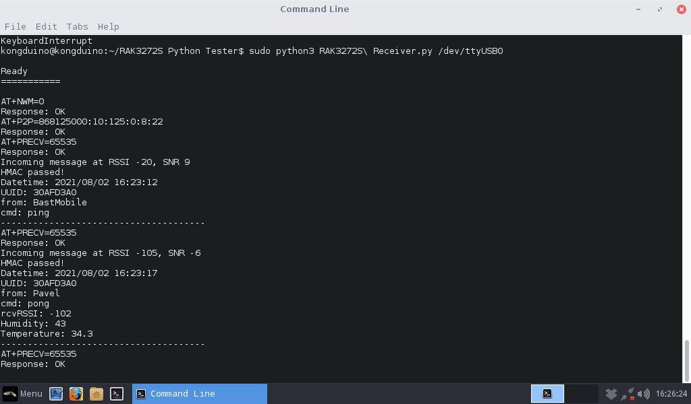

# RAK3272S

This is a collection of Python scripts (2 done, still evolving, more to come) and other info about the [RAK3272S](https://store.rakwireless.com/products/wisduo-breakout-board-rak3272s) Breakout Board. For now it comes with an [AT Firmware](https://docs.rakwireless.com/Product-Categories/WisDuo/RAK3272S-Breakout-Board/AT-Command-Manual/#introduction). Since the STM32WL is a new chip, it is quite a bit complicated to set up an environment to write C++ code for it (I've has a look at STM32CubeIDE, and I'm still dizzy from the deep dive...), so for now I am focusing on writing code that make using the AT firmware a little less painful and more user-friendly.

The STM32WL has been added to the STM32 Arduino BSP, sans the LoRa part. Once LoRa is available, I'll port my [Minimal LoRa](https://github.com/Kongduino/BastWAN_Minimal_LoRa) firmware to this chip, and we'll be able to use something a little less kludgy. In between, I'm going to work on tools that mimic the behavior of Minimal LoRa.

## Sender / Receiver

There are 2 scripts that do one thing each only: receiving or sending. The way the AT firmware is set up for P2P, it is a little complicated to have both. Basically, the firmware puts the chip in Tx mode, and if you want to receive, you have to let the firmware know, giving it a timeout value (stupid idea if you ask me). It's a 16-bit value, so the max value, 65535, means wait forever. Anything else, it waits that amount of milliseconds. Pfffrt. But what's worse, even if you're in the "wait forever" mode, once you receive a line, you're back to Tx mode. **THAT** is unusual cruelty.

So I had two breakout boards, and each was connected to a computer running one script. At startup, the script puts the firmware in P2P mode, sets up parameters (Frequency, SF, BW, etc) and sets Tx or Rx mode. The receiver will reset to receive mode every time a message is received.

Since these 2 operate on the same network of BastWAN devices I have, I need to emulate the protocol:

1. Messages are JSON packets. Not the most efficient, size-wise, but very easy to parse.
2. Messages are encrypted with AES256. So Sender needs to pad the packet and encrypt it. Receiver decrypts it.
3. But messages also have HMAC added to them. The last 28 bytes is the signature. Sender calculates SHA224 and tacks it on. Receiver compares the last 28 bytes with an HMAC it calculates on the rest of the packet.
4. Packets all have `UUID`, `from` and `cmd` keys. After which, there may or may not be other keys. Sender adds nothing else, but some of my BastWAN devices do. Receiver knows what to display. It also timestamps the packets so that you can keep a log of packets.

All in all, they already do quite a bit. I am looking into merging them, and adding more Minimal_Lora options. A more robust solution could involve making a GUI app in Xojo. We'll see...

